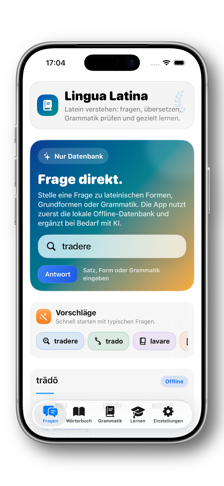

# Lingua Latina

Lingua Latina is a Latin learning and reference app for iPhone and iPad. It helps learners look up words and forms, understand grammar, analyse sentences, and study vocabulary.

The app is available for purchase on the [App Store](https://apps.apple.com/de/app/lingua-latina/id6767503541).

Visit the [German product site](https://h3pdesign.github.io/Lingua-Latina-Public/).

See the complete [h3pdesign portfolio](https://h3pdesign.github.io/) for all work and projects.

## Features

- Latin dictionary and inflected-form lookup
- Grammar, citations, sources, and study tools
- Sentence analysis with translations and word-by-word explanations
- Offline-first lookup in supported builds
- Optional Apple Intelligence, OpenAI, and local-model support

## Privacy

Lingua Latina does not require an account and does not include advertising, analytics, tracking, or developer-operated telemetry. Settings, favourites, and study progress are stored locally on the device.

When users explicitly enable an external AI provider, only the text needed for the selected request is sent to that provider. The app does not automatically upload the database, unrelated files, contacts, location, or study history.

Read the [privacy policy](https://apps-h3p.com/apps/lingua-latina/privacy-policy).

## Support and Contact

For questions about this public product-information repository, open an
[issue](https://github.com/h3pdesign/Lingua-Latina-Public/issues). The app is
supported and distributed through its [App Store listing](https://apps.apple.com/de/app/lingua-latina/id6767503541).

App releases are published through the App Store only. This repository does
not distribute application binaries or GitHub releases.

## Repository Scope

This is a public product-information repository. It contains selected documentation and visual assets only.

The following are intentionally excluded:

- Application source code
- Xcode projects and build configuration
- Bundled databases and proprietary content data
- StoreKit configuration and signing material
- App binaries and distribution credentials

## License

The contents of this repository are proprietary. See [LICENSE](LICENSE). The Lingua Latina application is distributed through the App Store and is subject to Apple's terms and the applicable purchase terms.
